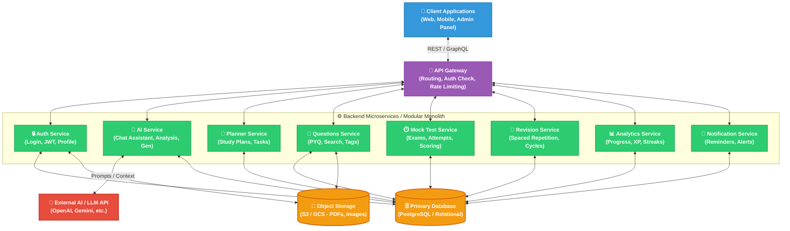

```mermaid
flowchart TD
    %% Define Styles
    classDef client fill:#3498db,stroke:#2980b9,stroke-width:2px,color:#fff,font-weight:bold
    classDef gateway fill:#9b59b6,stroke:#8e44ad,stroke-width:2px,color:#fff,font-weight:bold
    classDef service fill:#2ecc71,stroke:#27ae60,stroke-width:2px,color:#fff,font-weight:bold
    classDef db fill:#f39c12,stroke:#d35400,stroke-width:2px,color:#fff,font-weight:bold
    classDef external fill:#e74c3c,stroke:#c0392b,stroke-width:2px,color:#fff,font-weight:bold

    %% Nodes
    Client["📱 Client Applications\n(Web, Mobile, Admin Panel)"]:::client
    
    Gateway["🚪 API Gateway\n(Routing, Auth Check, Rate Limiting)"]:::gateway
    
    subgraph Backend Services ["⚙️ Backend Microservices / Modular Monolith"]
        Auth["🔒 Auth Service\n(Login, JWT, Profile)"]:::service
        AI["🤖 AI Service\n(Chat Assistant, Analysis, Gen)"]:::service
        Planner["📅 Planner Service\n(Study Plans, Tasks)"]:::service
        Questions["📝 Questions Service\n(PYQ, Search, Tags)"]:::service
        MockTest["⏱️ Mock Test Service\n(Exams, Attempts, Scoring)"]:::service
        Revision["🔄 Revision Service\n(Spaced Repetition, Cycles)"]:::service
        Analytics["📊 Analytics Service\n(Progress, XP, Streaks)"]:::service
        Notification["🔔 Notification Service\n(Reminders, Alerts)"]:::service
    end
    
    DB[("🗄️ Primary Database\n(PostgreSQL / Relational)")]:::db
    Storage[("📁 Object Storage\n(S3 / GCS - PDFs, Images)")]:::db
    LLM["🧠 External AI / LLM API\n(OpenAI, Gemini, etc.)"]:::external

    %% Connections
    Client <-->|REST / GraphQL| Gateway
    
    Gateway <--> Auth
    Gateway <--> AI
    Gateway <--> Planner
    Gateway <--> Questions
    Gateway <--> MockTest
    Gateway <--> Revision
    Gateway <--> Analytics
    Gateway <--> Notification

    %% Database Connections
    Auth <--> DB
    Planner <--> DB
    Questions <--> DB
    MockTest <--> DB
    Revision <--> DB
    Analytics <--> DB
    Notification <--> DB
    
    %% Storage Connections
    Questions <--> Storage
    Auth <--> Storage
    
    %% External API Connections
    AI <-->|Prompts / Context| LLM
    AI <--> DB
```
