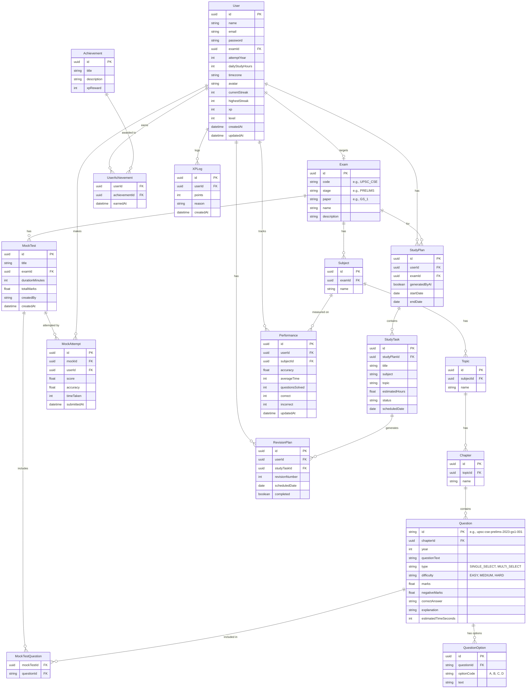

```mermaid
erDiagram
    User {
        uuid id PK
        string name
        string email
        string password
        uuid examId FK
        int attemptYear
        int dailyStudyHours
        string timezone
        string avatar
        int currentStreak
        int highestStreak
        int xp
        int level
        datetime createdAt
        datetime updatedAt
    }

    Exam {
        uuid id PK
        string code "e.g., UPSC_CSE"
        string stage "e.g., PRELIMS"
        string paper "e.g., GS_1"
        string name
        string description
    }

    Subject {
        uuid id PK
        uuid examId FK
        string name
    }

    Topic {
        uuid id PK
        uuid subjectId FK
        string name
    }

    Chapter {
        uuid id PK
        uuid topicId FK
        string name
    }

    Question {
        string id PK "e.g., upsc-cse-prelims-2023-gs1-001"
        uuid chapterId FK
        int year
        string questionText
        string type "SINGLE_SELECT, MULTI_SELECT"
        string difficulty "EASY, MEDIUM, HARD"
        float marks
        float negativeMarks
        string correctAnswer
        string explanation
        int estimatedTimeSeconds
    }

    QuestionOption {
        uuid id PK
        string questionId FK
        string optionCode "A, B, C, D"
        string text
    }

    MockTest {
        uuid id PK
        string title
        uuid examId FK
        int durationMinutes
        float totalMarks
        string createdBy
        datetime createdAt
    }
    
    MockTestQuestion {
        uuid mockTestId FK
        string questionId FK
    }

    MockAttempt {
        uuid id PK
        uuid mockId FK
        uuid userId FK
        float score
        float accuracy
        int timeTaken
        datetime submittedAt
    }

    StudyPlan {
        uuid id PK
        uuid userId FK
        uuid examId FK
        boolean generatedByAI
        date startDate
        date endDate
    }

    StudyTask {
        uuid id PK
        uuid studyPlanId FK
        string title
        string subject
        string topic
        float estimatedHours
        string status
        date scheduledDate
    }

    RevisionPlan {
        uuid id PK
        uuid userId FK
        uuid studyTaskId FK
        int revisionNumber
        date scheduledDate
        boolean completed
    }

    Performance {
        uuid id PK
        uuid userId FK
        uuid subjectId FK
        float accuracy
        int averageTime
        int questionsSolved
        int correct
        int incorrect
        datetime updatedAt
    }

    Achievement {
        uuid id PK
        string title
        string description
        int xpReward
    }

    UserAchievement {
        uuid userId FK
        uuid achievementId FK
        datetime earnedAt
    }

    XPLog {
        uuid id PK
        uuid userId FK
        int points
        string reason
        datetime createdAt
    }

    %% Relationships
    User ||--o| Exam : "targets"
    Exam ||--o{ Subject : "has"
    Subject ||--o{ Topic : "has"
    Topic ||--o{ Chapter : "has"
    Chapter ||--o{ Question : "contains"
    
    Question ||--o{ QuestionOption : "has options"
    
    Exam ||--o{ MockTest : "has"
    MockTest ||--o{ MockTestQuestion : "includes"
    Question ||--o{ MockTestQuestion : "included in"
    
    MockTest ||--o{ MockAttempt : "attempted by"
    User ||--o{ MockAttempt : "makes"
    
    User ||--o{ StudyPlan : "has"
    Exam ||--o{ StudyPlan : "for"
    StudyPlan ||--o{ StudyTask : "contains"
    
    User ||--o{ RevisionPlan : "has"
    StudyTask ||--o{ RevisionPlan : "generates"
    
    User ||--o{ Performance : "tracks"
    Subject ||--o{ Performance : "measured on"
    
    User ||--o{ UserAchievement : "earns"
    Achievement ||--o{ UserAchievement : "awarded to"
    User ||--o{ XPLog : "logs"

```
